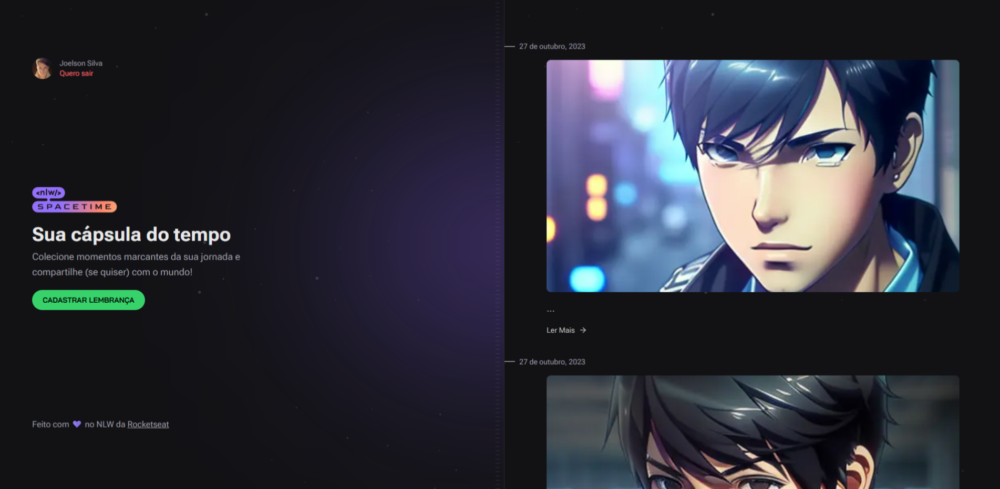

# Sobre

<h1 aling="center">Nlw SpaceTime</h1

<p>Nlw SpaceTime é uma aplicação de estudo criado pela instituição rockteseat a onde foram 5 aulas em uma semana durante o evento de aprendizando NLW</p>
<p>O objetivo do Nlw é cirar uma aplicação Caixa do tempo onde o usuario irar postar as suas lembranças sendo ela imagens, e videos e tambem dando a descrição da lembraça do dia, aplicaçaõ foi cosntruida em reactJs especificamento usando o nextJS ára versão web, react Native Mobile e como anco de dados o prisma studio</p>

<p>Essa é a Versão Web</p>

# Desktop

<p aling="center">
    
  
</p>

# Mobile

<p aling="center">
  
</p>

## 🧪 Technologies

Este Projeto foi desenvolvido usando seguintes tecnolias:

- [ReactJS](https://reactjs.org)
- [NextJS](https://nextjs.org/)
- [Tailwind Css](https://tailwindcss.com)
- [axio](https://axios-http.com/)
- [phosphor icon](https://phosphoricons.com/)
- [DayJs](https://day.js.org/)
- [Prisma](https://www.prisma.io/studio)

## 🚀 Getting started

Clone o projeto pare ter acessos dos arquivos.

```bash
git clone

cd web
```

Run this command to install the dependencies.

```bash
npm install

npm run dev
```

## 🔖 Layout

Você pode visualiza os projetos pelos links abaixo:

- [Live Preview]()

## 📝 License

This project is licensed under the MIT License. See the [LICENSE](LICENSE) file for details.

---

Made with 💜 by [JoeSeraphy]
